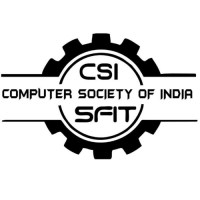

# FLASK FORWARD FUNDAMENTALS AND BEYOND

   

## Introduction
Flask is a micro web framework for python.  It allows developers to build web applications quickly and easily.   It is known for it's simplicity and flexibility.   It is a popular choice for both beginners and experienced developers.

## Steps to be followed:
- Clone The Repo:
  - git clone https://github.com/CSI-SFIT/Flask-Forward-Fundamentals-and-Beyond.git 
  - Paste the above command in your cmd.
    

- Flask Mail:
  - Set username as your SFIT email account
  - Set password as your email id password
  - Go to your SFIT account >> Manage Accounts >> Security >> Allow less secure apps
  
 

- XAMPP
  - Create a database [portfolio] and two tables in it named: 
    - projects  [sno, title, description, link, img_file, date]
    - contacts  [sno, name, phone, msg, date, email]
  - Else
    - Create a database [portfolio] and run the following SQL commands in SQL tab
    -     CREATE TABLE projects (
          sno INT AUTO_INCREMENT PRIMARY KEY,
          title TEXT,
          description TEXT,
          link VARCHAR(255),
          img_file VARCHAR(255),
          date DATE
          );
    -     CREATE TABLE contacts (
          sno INT AUTO_INCREMENT PRIMARY KEY,
          name TEXT,
          phone VARCHAR(20),
          msg TEXT,
          date DATE,
          email VARCHAR(255)
          );
     

- Sessions
  - Replace YOUR_NAME with your actual name.

## Acknowledgements
CSI SFIT Tech Team 2023 - 2024 

- Tech Head:
- Joint Tech Head:
- Tech Executives: 

      

    
